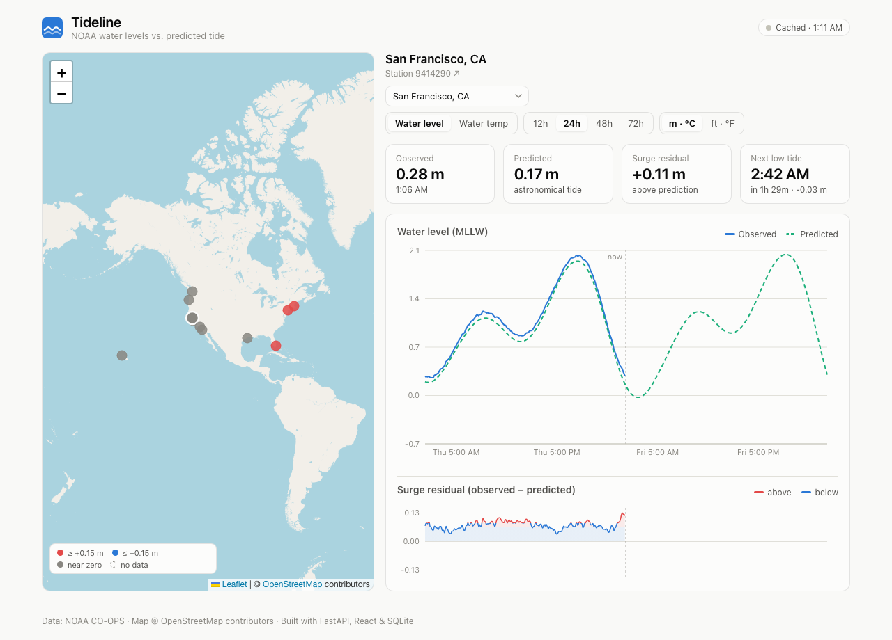
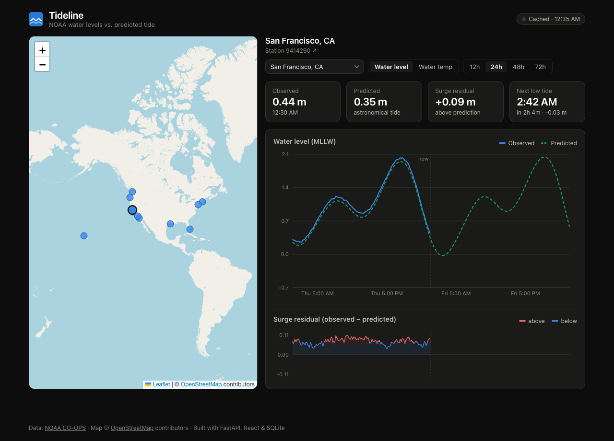
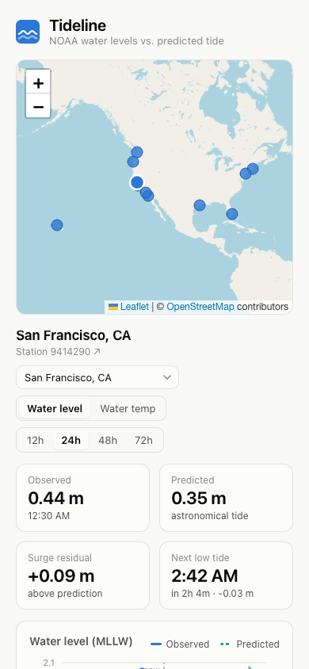
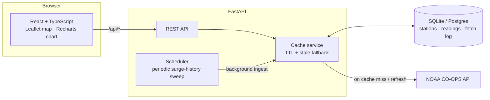

# Tideline 🌊

**Live NOAA water levels vs. astronomical tide predictions — and the surge residual between them.**

[](https://github.com/alejandro-publius/tideline/actions/workflows/ci.yml)
[](https://codecov.io/gh/alejandro-publius/tideline)
[](LICENSE)

**Live demo:** `TODO (human):` paste the deployed URL here — nothing is deployed yet. The repo deploys in one click (see [DEPLOY.md](DEPLOY.md) and [Deploying](#deploying-to-render-free-tier)) and runs locally in two commands.

Tideline pulls real-time coastal data from the [NOAA CO-OPS API](https://api.tidesandcurrents.noaa.gov/api/prod/), caches it in SQLite, and shows each station's **observed water level** against the **astronomical prediction** (the tide as pure celestial mechanics would have it). The difference between the two — the **surge residual** — is the interesting part: it's the signature of storm surge, wind setup, and pressure anomalies that the tide tables can't see.



<p align="center">
  
  
</p>

## Features

- **National surge overview** — map markers turn red/blue when a station runs beyond ±0.15 m of its predicted tide, so one glance shows which coast is anomalous right now
- **Interactive station map** — 13 NOAA stations across both coasts, Gulf, and Hawaii; click a marker or use the dropdown (the map pans to off-screen picks)
- **Observed vs. predicted overlay chart** with a "now" marker, so you can see the upcoming tide as well as the last few days
- **Surge residual chart** — a diverging mini-chart of observed − predicted with a crosshair synced to the main chart; a rising residual is what a storm looks like
- **Next high/low tide** with a live countdown, derived from the prediction series
- **Shareable URLs** — station, product, and time range round-trip through the query string
- **Read-through cache with graceful degradation** — repeated requests serve from SQLite; if NOAA is unreachable the API returns the last known data flagged `stale`, and the UI offers a retry
- **Resilient NOAA pipeline** — transient upstream failures (network errors, 5xx) retry with exponential backoff; deterministic ones fail fast and degrade to the stale cache instead of hammering a struggling API
- **Rate-limited, observable API** — per-client token bucket (`429` + `Retry-After`, health checks exempt) and Prometheus-format counters at `/api/metrics`: requests by route, cache hit/miss/stale, NOAA outcomes and retries, throttles
- **CSV dataset export** — each station's accumulated observed/predicted/surge history as an analysis-ready download, one click from the dashboard
- Stations without a sensor for a product (SF has no thermometer!) get a friendly empty state, not an error
- **Metric/US units toggle** (m·°C / ft·°F) — data stays metric internally; conversion happens only at the display boundary
- Water temperature as a second data product, 5-minute auto-refresh, responsive layout, automatic dark mode, loading skeletons, split vendor chunks

## Architecture



The cache is the heart of the backend (`backend/app/service.py`):

1. Every `(station, product)` pair has a **fetch log** entry recording when it was last refreshed from NOAA (TTL: 10 min for observations, 12 h for predictions — astronomy doesn't change often).
2. On a cache miss, the service **always fetches the full 72-hour window**, not just the requested range — otherwise a narrow request could mark a wide range as "fresh" while the database only holds a sliver of it.
3. Readings are **upserted**, so history accumulates across pulls and re-fetches never duplicate rows.
4. If NOAA errors or times out, previously cached data is served with `source: "stale"` — the dashboard stays useful through an upstream outage and says so in the header badge.

All timestamps are stored as naive UTC and serialized with an explicit `Z` suffix; the frontend renders them in the viewer's local time.

The decisions behind this shape — cache vs. scheduled ingestion, SQLite-first, the retry policy, in-process rate limiting — are written up as [architecture decision records](docs/adr/).

## Engineering challenges

The interesting problems, in brief; the full narrative is in [WRITEUP.md](WRITEUP.md).

- **Reconciling predictions against observations.** Observed levels and astronomical predictions are two independent NOAA products; their difference is only meaningful when both are sampled at the *same* instant, so readings are stored on NOAA's native 6-minute grid and paired by exact timestamp.
- **Computing the surge residual.** `observed − predicted` is the entire non-astronomical signal — storm surge, wind setup, pressure anomalies. It's aggregated per UTC day for the history view and exposed row-by-row via CSV export.
- **Missing and late readings.** Sensor gaps arrive as empty values, maintenance windows as non-JSON `200`s, and some stations lack a sensor entirely — all treated as *absence*, never as zero and never as a crash.
- **Time-series storage and accumulation.** Refreshes upsert over the full 72-hour window, so history accumulates without duplicate rows; a background sweep keeps it growing with no visitors, which is what makes daily-surge history and export possible without a separate ingestion pipeline.
- **NWS flood-stage mapping.** Observed levels are classified against each station's official minor/moderate/major thresholds (meters above MLLW), so the map shows not just "anomalous" but "anomalous relative to what floods *here*."
- **NOAA rate limiting and flakiness.** The read-through cache collapses repeated requests; transient failures retry with exponential backoff while deterministic ones fail fast; an in-process memo de-duplicates identical calls — together keeping load on NOAA low and the app responsive when NOAA isn't.

## Security & operations

- **Rate limiting** (`backend/app/ratelimit.py`): a token bucket per client IP — burst up to 120 requests, refilled continuously — returns `429` with `Retry-After` beyond the budget. `/api/healthz` is exempt so a throttled client can't make the platform health check report the service down, and the bucket map is pruned so address-cycling can't grow it without bound.
- **Metrics** (`backend/app/metrics.py`): counters exposed at `/api/metrics` in Prometheus text format. Request labels use the matched route *template*, not the raw URL, so path parameters and scanner probes can't mint unbounded label values.
- **Structured logs**: retries, stale fallbacks, and background sweeps are logged as key=value events.
- **Contained blast radius elsewhere**: CORS allows `GET` only, the Docker image runs as a non-root user, and Dependabot keeps all four ecosystems (pip, npm, Actions, Docker) patched weekly with CI as the merge gate.

## API

Interactive docs at `/docs` (Swagger UI, generated by FastAPI).

| Endpoint | Description |
|---|---|
| `GET /api/stations` | All stations with coordinates |
| `GET /api/overview` | Latest observed level, prediction, and surge for every station (powers the map colors); stale stations refresh from NOAA in parallel threads |
| `GET /api/stations/{id}/readings?product=water_level&hours=24` | Observed readings for the trailing window (1–72 h); `product` may also be `water_temperature` |
| `GET /api/stations/{id}/predictions?hours=24` | Astronomical tide predictions from `hours` ago (1–72 h) to up to 48 h ahead |
| `GET /api/stations/{id}/history?days=30` | Daily surge statistics (avg/max/samples) from accumulated history — served entirely from the database (1–365 d) |
| `GET /api/stations/{id}/export?days=30` | Accumulated observed/predicted/surge history as a CSV download (1–365 d) |
| `GET /api/metrics` | Operational counters, Prometheus text format |
| `GET /api/healthz` | Health check (never rate-limited) |

Series responses include `source` (`noaa` / `cache` / `stale`) and `fetched_at`, so clients can tell exactly how fresh the data is.

## Tech stack

| Layer | Choices |
|---|---|
| Backend | Python 3.12, FastAPI, SQLAlchemy 2.0, httpx, pydantic-settings |
| Database | SQLite (swap to Postgres by changing `TIDELINE_DATABASE_URL` — no dialect-specific SQL) |
| Frontend | React 19, TypeScript, Vite, react-leaflet, Recharts |
| Tests | pytest + respx (NOAA mocked at the HTTP transport layer); Vitest for frontend logic |
| CI/CD | GitHub Actions → Docker → Render; Dependabot for dependency updates |
| Tooling | Makefile dev shortcuts, ruff, oxlint, [ADRs](docs/adr/) for design decisions |

## Running locally

Backend (Python ≥ 3.11):

```bash
cd backend
python -m venv .venv && source .venv/bin/activate
pip install -e ".[dev]"
uvicorn app.main:app --reload        # http://127.0.0.1:8000
```

Frontend (Node ≥ 20), in a second terminal:

```bash
cd frontend
npm install
npm run dev                          # http://localhost:5173, proxies /api to the backend
```

After the one-time setup, `make backend` / `make frontend` start either server and `make help` lists the rest (tests, lint, format).

### Demo data (no NOAA needed)

To explore the full app offline — map colors, surge history, CSV export — seed realistic synthetic tides (semidiurnal + diurnal predictions, plus an observed level with a storm-surge residual):

```bash
cd backend && python -m app.seed_demo --days 14
```

This populates the database and marks the cache fresh, so every endpoint serves without a live NOAA connection — handy for a reviewer or a screenshot.

### Tests

```bash
cd backend && pytest -v      # 50 tests (or: make test-backend)
cd frontend && npm test      # 21 tests (or: make test-frontend)
```

The backend suite covers the full cache lifecycle (cold → warm → expired → stale fallback), the full-window refresh invariant, upsert de-duplication, NOAA response parsing (sensor gaps, no-sensor stations, non-JSON maintenance pages), the retry policy (transient vs. deterministic failures, backoff timing with an injected sleeper), rate limiting (bucket math against a fake clock, `429`/`Retry-After` behavior, health-check exemption, bucket pruning), metrics (route-template labels, cardinality bounds), CSV export, flood-stage classification, the overview sweep (including one-station-failure resilience), history aggregation, gzip, and request validation — NOAA is mocked with `respx`, so everything runs offline in a few seconds. In CI the same suite also runs against a real `postgres:16`. The frontend suite covers the tide math (series merging, surge residual, next-extreme detection, axis ticks, unit conversion) and URL state round-tripping.

## Docker

```bash
docker build -t tideline .
docker run -p 8000:8000 tideline     # SPA + API on http://localhost:8000
```

The image is multi-stage: Node builds the frontend, then a slim Python image serves the static bundle and the API from a single process — no reverse proxy needed.

## Deploying to Render (free tier)

1. Fork/push this repo to GitHub.
2. On [Render](https://render.com): **New → Blueprint**, select the repo — `render.yaml` configures everything (Docker runtime, health check on `/api/healthz`).
3. That's it. Pushes to `main` auto-deploy.

Note: the free tier has an ephemeral disk, so cached history resets on redeploys — the app simply re-fetches from NOAA. Attach a persistent disk mounted at `/data` (or point `TIDELINE_DATABASE_URL` at a managed Postgres) to keep history.

## Configuration

All settings are environment variables with sensible defaults (`backend/app/config.py`):

| Variable | Default | Purpose |
|---|---|---|
| `TIDELINE_DATABASE_URL` | `sqlite:///./tideline.db` | SQLAlchemy database URL |
| `TIDELINE_CACHE_TTL_MINUTES` | `10` | Freshness window for observations |
| `TIDELINE_PREDICTIONS_TTL_MINUTES` | `720` | Freshness window for tide predictions |
| `TIDELINE_HISTORY_REFRESH_MINUTES` | `30` | Background sweep interval that keeps surge history accumulating without visitors (`0` disables) |
| `TIDELINE_RATE_LIMIT_PER_MINUTE` | `120` | Per-client API request budget, token bucket (`0` disables limiting) |
| `TIDELINE_NOAA_MAX_RETRIES` | `3` | Retry budget for transient NOAA failures (network errors, 5xx) |
| `TIDELINE_NOAA_BACKOFF_BASE` | `0.5` | Exponential backoff base between retries, in seconds |
| `TIDELINE_NOAA_CACHE_TTL_SECONDS` | `60` | In-process memo TTL for identical NOAA requests |
| `TIDELINE_LOG_LEVEL` | `INFO` | Logging verbosity |
| `TIDELINE_CORS_ORIGINS` | `http://localhost:5173` | Comma-separated allowed origins (empty = CORS off) |
| `TIDELINE_STATIC_DIR` | *(empty)* | If set, serve the built frontend from this directory |
| `TIDELINE_NOAA_BASE_URL` | NOAA CO-OPS prod URL | Upstream data API (overridable for testing) |

## License

[MIT](LICENSE)
