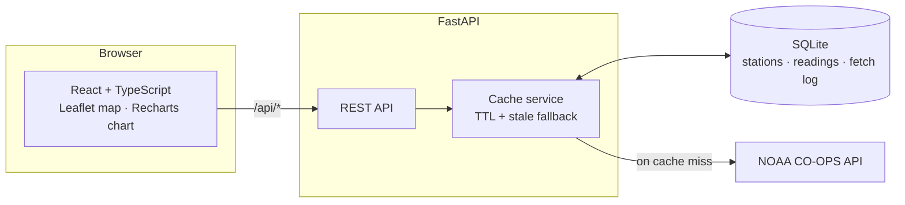

# Tideline 🌊

**Live NOAA water levels vs. astronomical tide predictions — and the surge residual between them.**

[](https://github.com/alejandro-publius/tideline/actions/workflows/ci.yml)

**Live demo:** <https://tideline.onrender.com> *(free tier — first load may take ~50 s to wake)*

Tideline pulls real-time coastal data from the [NOAA CO-OPS API](https://api.tidesandcurrents.noaa.gov/api/prod/), caches it in SQLite, and shows each station's **observed water level** against the **astronomical prediction** (the tide as pure celestial mechanics would have it). The difference between the two — the **surge residual** — is the interesting part: it's the signature of storm surge, wind setup, and pressure anomalies that the tide tables can't see.


<p align="center">
  
  
</p>

## Features

- **Interactive station map** — 13 NOAA stations across both coasts, Gulf, and Hawaii; click a marker to switch stations
- **Observed vs. predicted overlay chart** with a "now" marker, so you can see the upcoming tide as well as the last few days
- **Surge residual** computed live: how far the water is above or below what the tide alone explains
- **Next high/low tide** derived from the prediction series
- **Read-through cache with graceful degradation** — repeated requests serve from SQLite; if NOAA is unreachable the API returns the last known data flagged `stale` instead of failing
- Water temperature as a second data product, responsive layout, automatic dark mode

## Architecture



The cache is the heart of the backend (`backend/app/service.py`):

1. Every `(station, product)` pair has a **fetch log** entry recording when it was last refreshed from NOAA (TTL: 10 min for observations, 12 h for predictions — astronomy doesn't change often).
2. On a cache miss, the service **always fetches the full 72-hour window**, not just the requested range — otherwise a narrow request could mark a wide range as "fresh" while the database only holds a sliver of it.
3. Readings are **upserted**, so history accumulates across pulls and re-fetches never duplicate rows.
4. If NOAA errors or times out, previously cached data is served with `source: "stale"` — the dashboard stays useful through an upstream outage and says so in the header badge.

All timestamps are stored as naive UTC and serialized with an explicit `Z` suffix; the frontend renders them in the viewer's local time.

## API

Interactive docs at `/docs` (Swagger UI, generated by FastAPI).

| Endpoint | Description |
|---|---|
| `GET /api/stations` | All stations with coordinates |
| `GET /api/stations/{id}/readings?product=water_level&hours=24` | Observed readings for the trailing window (1–72 h); `product` may also be `water_temperature` |
| `GET /api/stations/{id}/predictions?hours=24` | Astronomical tide predictions from `hours` ago to `hours` ahead (1–48 h) |
| `GET /api/healthz` | Health check |

Series responses include `source` (`noaa` / `cache` / `stale`) and `fetched_at`, so clients can tell exactly how fresh the data is.

## Tech stack

| Layer | Choices |
|---|---|
| Backend | Python 3.12, FastAPI, SQLAlchemy 2.0, httpx, pydantic-settings |
| Database | SQLite (swap to Postgres by changing `TIDELINE_DATABASE_URL` — no dialect-specific SQL) |
| Frontend | React 19, TypeScript, Vite, react-leaflet, Recharts |
| Tests | pytest + respx (NOAA mocked at the HTTP transport layer) |
| CI/CD | GitHub Actions → Docker → Render |

## Running locally

Backend (Python ≥ 3.11):

```bash
cd backend
python -m venv .venv && source .venv/bin/activate
pip install -e ".[dev]"
uvicorn app.main:app --reload        # http://127.0.0.1:8000
```

Frontend (Node ≥ 20), in a second terminal:

```bash
cd frontend
npm install
npm run dev                          # http://localhost:5173, proxies /api to the backend
```

### Tests

```bash
cd backend
pytest -v
```

The suite covers the full cache lifecycle (cold → warm → expired → stale fallback), the full-window refresh invariant, upsert de-duplication, NOAA response parsing (including sensor gaps), and request validation. NOAA is mocked with `respx`, so tests run offline in ~0.3 s.

## Docker

```bash
docker build -t tideline .
docker run -p 8000:8000 tideline     # SPA + API on http://localhost:8000
```

The image is multi-stage: Node builds the frontend, then a slim Python image serves the static bundle and the API from a single process — no reverse proxy needed.

## Deploying to Render (free tier)

1. Fork/push this repo to GitHub.
2. On [Render](https://render.com): **New → Blueprint**, select the repo — `render.yaml` configures everything (Docker runtime, health check on `/api/healthz`).
3. That's it. Pushes to `main` auto-deploy.

Note: the free tier has an ephemeral disk, so cached history resets on redeploys — the app simply re-fetches from NOAA. Attach a persistent disk mounted at `/data` (or point `TIDELINE_DATABASE_URL` at a managed Postgres) to keep history.

## Configuration

All settings are environment variables with sensible defaults (`backend/app/config.py`):

| Variable | Default | Purpose |
|---|---|---|
| `TIDELINE_DATABASE_URL` | `sqlite:///./tideline.db` | SQLAlchemy database URL |
| `TIDELINE_CACHE_TTL_MINUTES` | `10` | Freshness window for observations |
| `TIDELINE_PREDICTIONS_TTL_MINUTES` | `720` | Freshness window for tide predictions |
| `TIDELINE_CORS_ORIGINS` | `http://localhost:5173` | Comma-separated allowed origins (empty = CORS off) |
| `TIDELINE_STATIC_DIR` | *(empty)* | If set, serve the built frontend from this directory |

## License

[MIT](LICENSE)
